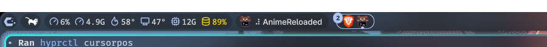
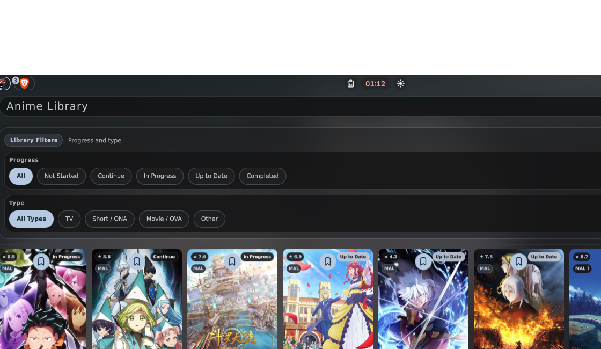

# AnimeReloaded for Noctalia

AnimeReloaded is the next-generation continuation of the original Noctalia Anime plugin.

## Highlights

- AniList-backed browse, search, detail pages, titles, synonyms, relations, seasons, and airing metadata
- AllAnime preserved for episode resolution, stream lookup, and playback
- season-aware detail flow so selecting another season opens that season and its episodes instead of flattening the whole franchise
- local AniList `<->` AllAnime mapping/cache layer for safe playback resolution
- feed focused on currently watched releasing shows that are close to caught up, plus newly relevant release events
- MyAnimeList sync for account progress, without switching in-app metadata away from AniList
- polished Noctalia-native UI with smoother card scrolling, consistent chips/buttons, and refreshed library/settings flows

## Screenshots

Desktop integration preview:



Library panel:



## What Works Now

- Browse and search are AniList-backed.
- Detail pages use AniList metadata and show season-level navigation, relations, and season-specific episodes.
- Playback still resolves through AllAnime when the user actually starts an episode.
- Library uses MyAnimeList-style list statuses: `Watching`, `Completed`, `On Hold`, `Dropped`, and `Plan To Watch`.
- Library status chips support multi-select filtering, and local status handling now stays aligned with MAL sync semantics.
- Feed tracks releasing seasons you are actively watching and close to current on, then surfaces new episodes when they become relevant.
- Detail and library progress actions support catching up or marking fully watched when appropriate.
- Startup includes a schema-versioned library migration that normalises legacy metadata refs and promotes legacy `malId` values into `providerRefs.sync`.
- Settings now include runtime self-checks plus a one-click playback mapping repair pass for unresolved library entries.
- MyAnimeList sync supports browser login, pull, push, optional auto-push, per-title sync badges, and MAL-aligned status/progress payloads.

## Feed Direction

Feed is no longer treated as a generic “everything in the library that might be airing” list.

Current behavior is centered on actively watched releasing seasons:

- AniList airing status and next-airing data drive eligibility
- only `watching` entries that are near current pace are followed automatically
- titles that drift too far behind fall out of Feed until you catch back up
- followed titles are evaluated as specific AniList season/media entries
- newly relevant episode events are surfaced more clearly
- uncertain legacy mappings are skipped instead of guessed

This keeps Feed aligned with the long-term goal of becoming a practical release notification center.

## MyAnimeList Sync

AnimeReloaded keeps AniList as the canonical in-app metadata source and uses MyAnimeList only for account sync.

Current MAL sync behavior:

- browser auth through the deployed AnimeReloaded MAL backend only
- `Pull From MAL` to merge external progress and import MAL-only titles that resolve confidently to AniList
- `Push To MAL` to send both local status and watched-episode progress outward
- optional auto-push after local watch changes
- per-show MAL badges in Library and Detail
- sync overview focused on titles needing attention, ready-to-push titles, and recently synced titles
- stale legacy OAuth override fields are no longer part of the shipped settings model


Status handling now follows MAL-style rules closely:

- new library entries start as `plan_to_watch`
- starting progress promotes them to `watching`
- known completions are pushed as `completed`
- `on_hold` and `dropped` are treated as explicit states rather than inferred guesses

## Repository Layout

```text
.
├── anime-reloaded/         # plugin runtime for catalog installs
│   ├── provider_cli.py     # provider-aware command bridge used by QML
│   ├── providers/          # metadata, stream, and mapping layers
│   ├── components/         # Browse, Library, Detail, Feed, Settings UI
│   ├── Main.qml
│   ├── Panel.qml
│   ├── BarWidget.qml
│   └── manifest.json
├── docs/screenshots/       # README screenshots
├── manifest.json           # local-install compatibility manifest
├── registry.json
└── README.md
```

## Local Install

Clone this repository into your Noctalia plugins directory, then enable `AnimeReloaded` from the Plugins view.

```text
~/.config/noctalia/plugins/
└── AnimeReloaded/
```

The root manifest keeps local checkouts loadable, while the actual plugin runtime stays in `anime-reloaded/`.

## Requirements

- `python3` in `$PATH`
- `python3-cryptography` (or equivalent Python `cryptography` package) available to the plugin runtime
- `mpv` in `$PATH`
- network access to AniList, AllAnime, MyAnimeList, and resolved stream hosts

The Settings view includes a runtime self-test that checks the local Python/mpv/cryptography stack and MAL backend reachability.

## Local Runtime Files

AnimeReloaded stores local runtime data in the plugin directory with `anime-reloaded-*` names, including:

- `anime-reloaded-library.json`
- `anime-reloaded-feed-cache.json`
- `anime-reloaded-provider-map.json`
- `anime-reloaded-mal-config.json`

`anime-reloaded-mal-config.json` contains local MAL backend session data and should remain untracked.

## Related Links

- Legacy Anime plugin: [demencia89/noctalia-shell-anime-plugin](https://github.com/demencia89/noctalia-shell-anime-plugin)

## License

MIT. See `LICENSE`.
